<h1 align="center">Hi 👋, I'm Mohamed Asif</h1>

<h3 align="center">
  B.Tech IT Student | Aspiring Data Analyst | AI & ML Enthusiast
</h3>

  

---

## 👨‍💻 About Me

- 🎓 3rd Year **B.Tech Information Technology Student**
- 📊 Aspiring **Data Analyst** with a growing interest in **AI & Machine Learning**
- 🐍 Strong foundation in **Python** and Python data analysis libraries
- 🗃️ Completed **SQL fundamentals** and actively practicing analytical SQL problems
- 📈 Currently learning **Power BI** for interactive data visualization and dashboards
- 🔍 Experienced in **Exploratory Data Analysis (EDA)** using real-world datasets
- 💡 I learn by building projects and solving real-world problems
- 🧠 Currently improving my problem-solving skills through **LeetCode**
- 🚀 Interested in combining **Data Analytics, Machine Learning and AI**

---

## 🛠️ Tech Stack

### Programming & Databases

  

### Data Analytics

- 📊 Microsoft Excel
- 🐼 Pandas
- 🔢 NumPy
- 📈 Matplotlib
- 📊 Seaborn
- 🗃️ SQL
- 📊 Power BI *(Currently Learning)*

---

## 🚀 Featured Projects

| Project | Description |
|---------|-------------|
| 📺 [Netflix Data Analysis](https://github.com/mohamedasif06/Netflix-Data-Analysis) | End-to-end EDA project using Python, Pandas, Matplotlib and Seaborn. Cleaned 7,900+ Netflix titles, analyzed content trends and generated business insights. |
| 📊 Retail Store Sales Dashboard | Interactive Excel dashboard using Pivot Tables, charts and data analysis. |
| 🗃️ Netflix SQL Analytics | SQL-based analysis of the Netflix dataset using aggregations, joins, subqueries, CTEs and window functions. |
| 📈 SQL Practice | Analytical SQL problems focused on joins, aggregations, subqueries and window functions. |

---

## 📺 Netflix Data Analysis

My first complete Data Analytics portfolio project.

### 🔍 What I analyzed

- 🎬 Movies vs TV Shows
- 🎭 Top Genres
- 🌎 Top Countries
- ⭐ Ratings Distribution
- 📅 Titles Added Per Year
- 📆 Titles Added Per Month
- ⏱️ Movie Duration Analysis

### 🛠️ Technologies

`Python` `Pandas` `NumPy` `Matplotlib` `Seaborn`

### 📌 Key Skills Demonstrated

- Data Cleaning
- Missing Value Handling
- Duplicate Detection
- Data Transformation
- Exploratory Data Analysis
- Data Visualization
- Business Insight Generation

🔗 **[View Project on GitHub](https://github.com/mohamedasif06/Netflix-Data-Analysis)**

---

## 🧩 Problem Solving

I'm actively improving my problem-solving and SQL skills through LeetCode.

### 🎯 Current Progress

- 🧩 **35+ LeetCode problems solved**
- 🗃️ Practicing SQL problems
- 🐍 Practicing Python problems
- 📚 Working toward stronger DSA fundamentals

### 🎯 Next Milestones

`40 Problems` → `50 Problems` → `100 Problems`

---

## 📚 Currently Learning

- 🔄 **Power BI** — Data modeling, Power Query, DAX & dashboards
- 🔄 **SQL Analytics** — Real-world analytical problem solving
- 🔄 **DSA & Problem Solving** — Python
- 🔜 **Statistics for Data Science**
- 🔜 **Machine Learning**
- 🔜 **AI & Agentic AI**

---

## 📊 GitHub Stats

  
  

---

## 🔥 GitHub Streak

  

---

## 📈 My GitHub Activity

  

---

## 🎯 Goals

- 🚀 Build strong foundations in **Data Analytics**
- 🗃️ Become highly proficient in **SQL**
- 📊 Build professional **Power BI dashboards**
- 🧠 Strengthen **DSA & problem-solving**
- 🤖 Learn **Machine Learning**
- 🧩 Explore **Agentic AI**
- 💼 Secure a **Data Analyst / AI-related Internship**
- 📂 Build a strong and practical GitHub portfolio

---

## 📫 Connect With Me

  
  

---

  

<h3 align="center">
  ⭐ Turning Data into Insights, and Ideas into Projects.
</h3>
